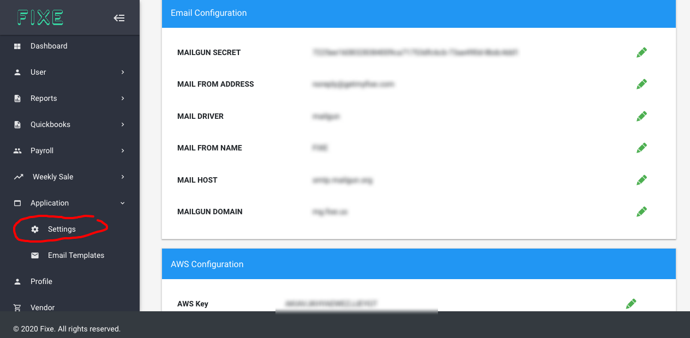
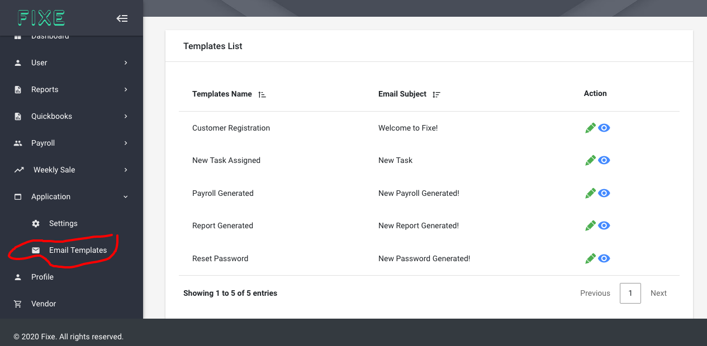

# Application / Settings

## Settings ##
On the Application nav we’ve options for application settings where we can add all the settings related to this application, storage, logz etc admin can edit/change values also.

## Email Tempates ##
Next is Email template where we’ve different template list which will be used in emails and admin has the option to edit and view emails as well.

