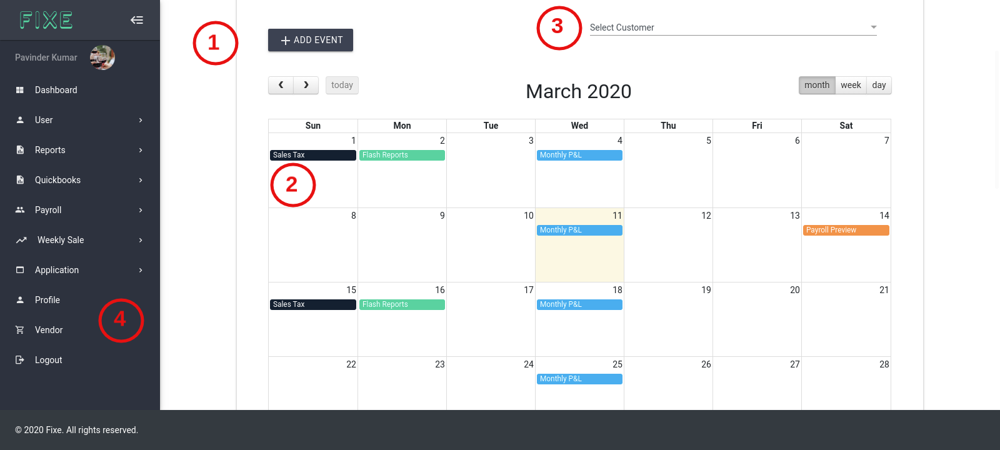

# Dashboard

### First, let’s review our dashboard part what you will see here.

1. Admin can add Events for all users registered to the Fixe App. On **Add Event** button click will open an event form where you can do the following things:
  * Select customers from the list
  * Choose an event type
  * Add description for the event
  * Start date of event
  * Repetition of event 
    * Weekly
    * ByWeekly
    * Monthly
    * ByMonthly(1st and 15 of the month)
2. After adding an event you wil see all the events in the calendar in different colors as per event type you’ve selected. If you hover your mouse over any event you will see the event title and description and also some action buttons like **Edit/Delete/View**. If you are admin and if you logged in as a normal user you will see only view button to visit event.
3. Next you can also filter all the events as per customer drop down list if you logged in as admin otherwise you will see only your events there in the calendar.
4. On the Left sidebar you will see User logo along with name and all the navigations.

### Flash Report:- You will also see Weekly Flash Report in the dashboard as well
