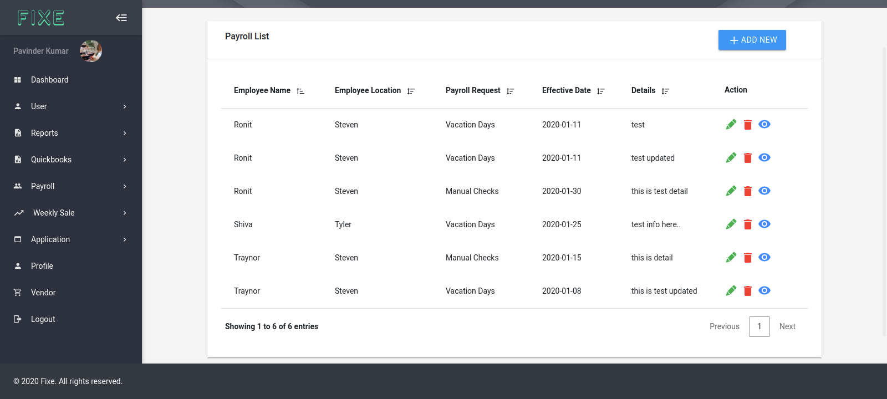
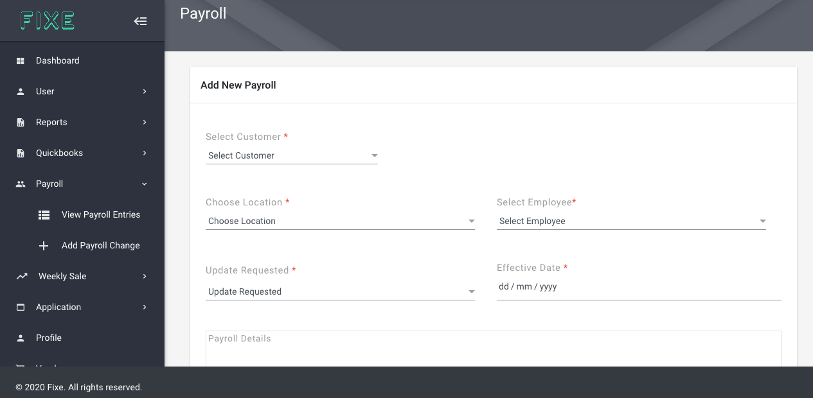

# Payroll

On the Payroll Nav there are two child nav. 
View All Payroll
Add Payroll Change

Admin and customer can add new payroll for the employee and can also see all the list of payroll added to fixe.

## View All Payroll ##
Here you can see all the list of payroll entries. Along with action buttons for edit, delete, view

## Add Payroll ##
Add payroll has a simple form for adding new payroll simply needs to select customer its location and then choose any employee , enter all the info related to payroll.

