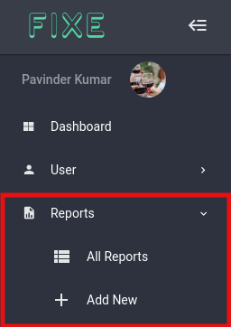
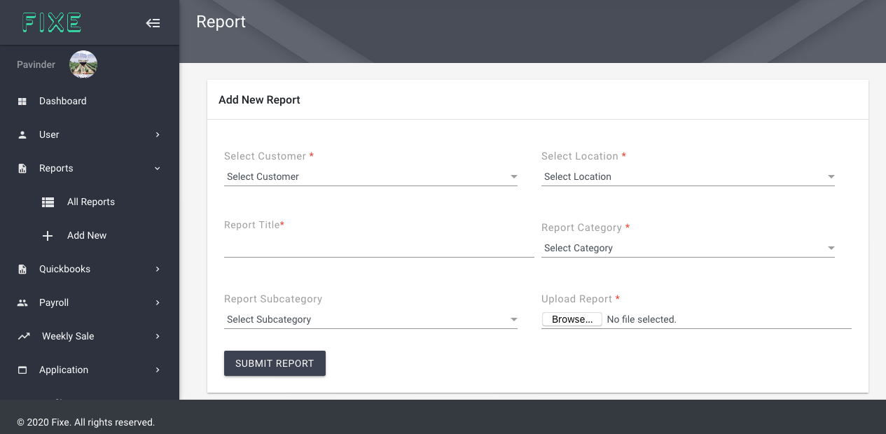
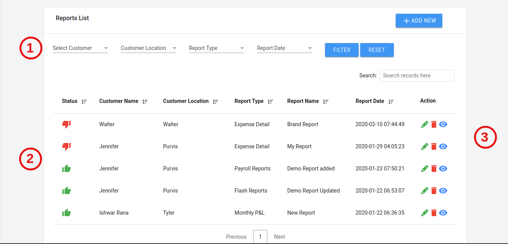
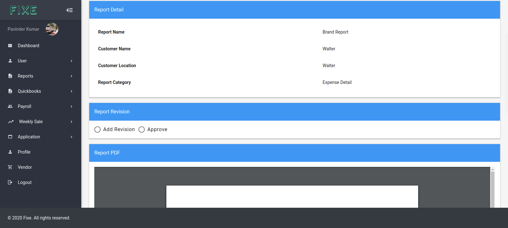

# Reports

On the Report nav there are two child menus for viewing all reports and adding new reports to fixe. Only the admin can see add new report option.

## Adding New Report ##

For adding new Report to the fixe. Admin need to select the customer, his location, report title , Report Category, Report PDF. 

## View all Report ##
On the View all tab here you can see all the reports uploaded to the fixe app. Here you can search for any reports. Filter through the reports and can also view report on single page

  1. This is the Report filter you can filter reports by customers, location, report type and report date, and also reset any filtration applied to the app
  2. You will also see thumbs up and down for report status after getting approved or not 
  3. There are three action buttons also available for edit,delete,view. 

## Single View Report ##
Here you will see the complete info related to the report along with the pdf file of the report. There is a report revision section also where customers can add revision to the report and also can see all the previous revision list.  there is an approve button also for approving reports which will then set  the status approved for the reports.

