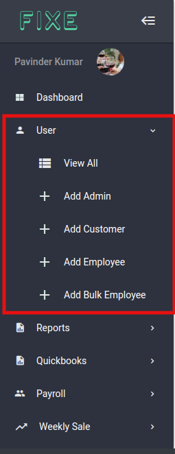

# Users

**Let's walk through our first module which is the users module. This is where you can create users for our app and can set specific role for them in the app.**

So if you are logged into the app you see all the options under the user navigation. 
1. Can View all the user registered into our app
2. Can add New Admin 
3. Can add Customers
4. Can add Single Employee
5. Can add Employees on bulk
    
> Lets discuss all of them on by one

1. **View All Users**
  
  Here you will see all the registered users of the app and will see their info such as name,email,employee type and their last login date and time and some action buttons for Edit user,Delete user, View user where you can see all the info related to the users. See screenshot below:

  
