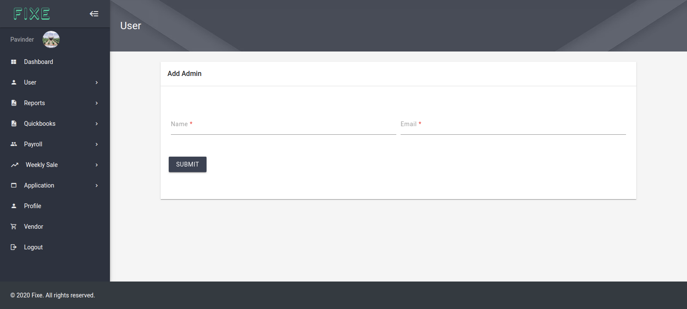

# Users

**Let's walk through our first module which is the users module. This is where you can create users for our app and can set specific role for them in the app.**

So if you are logged into the app you see all the options under the user navigation. 

* [Can view all the user registered into our app](#view-all-users)
* [Can add New Admin](#add-new-admin)
* [Can add Customers](#add-new-customer)
* [Can add New Employee](#add-new-employee)
* [Can add Employees on bulk](#add-bulk-employee)

    
> Lets discuss all of them on by one

## View All Users ##
  
  Here you will see all the registered users of the app and will see their info such as name, email, employee type, their last login date/time and some action buttons for **edit user, delete user, view user**. See screenshot below:

  

## Add New Admin ##
  Admin can add new admin to the fixe app. For adding new admin we need name and email for admin users. When admin is created an email is forwarded to admin and user with the login info

  

## Add New Customer ##

  Admin can **add new customers** to the **Fixe App**. For adding new customer we need customer information along with location information and logo as well

  

## Add New Employee ##
  
  Admin can **Add New Employee** to the **Fixe App** infew steps that are mentioned below: 
    
* Select Customer
* Choose location
* Employee Type

With this admin can add new employees for any customer to its location.

## Add bulk Employee ##

  Admin also have the option to add employees in bulk. If admin wants to add multiple employees for any customer he can add multiple employees by simply clicking on add more button then add employee info.
  
  